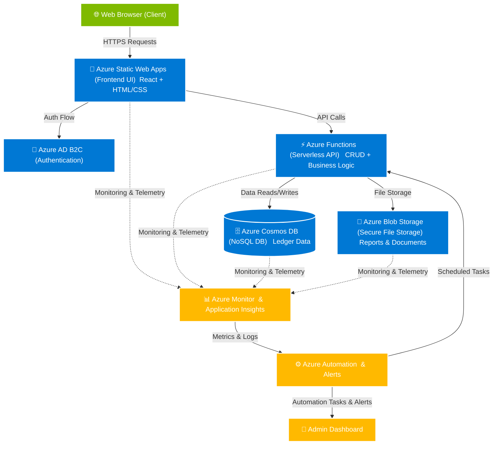

```mermaid
flowchart TB
    %% Client Layer
    Browser["🌐 Web Browser (Client)"]
    
    %% Frontend Layer
    StaticWebApps["📱 Azure Static Web Apps  (Frontend UI)  React + HTML/CSS"]
    
    %% Authentication
    ADB2C["🔐 Azure AD B2C  (Authentication)"]
    
    %% Backend Layer
    Functions["⚡ Azure Functions   (Serverless API)   CRUD + Business Logic"]
    
    %% Data Layer
    CosmosDB[("🗄️ Azure Cosmos DB   (NoSQL DB)   Ledger Data")]
    BlobStorage["📂 Azure Blob Storage   (Secure File Storage)   Reports & Documents"]
    
    %% Monitoring & Automation
    Monitor["📊 Azure Monitor  &  Application Insights"]
    Automation["⚙️ Azure Automation  &  Alerts"]
    Admin["👤 Admin Dashboard"]

    %% Connections with Labels
    Browser -->|"HTTPS Requests"| StaticWebApps
    StaticWebApps -->|"Auth Flow"| ADB2C
    StaticWebApps -->|"API Calls"| Functions
    Functions -->|"Data Reads/Writes"| CosmosDB
    Functions -->|"File Storage"| BlobStorage
    
    %% Monitoring Connections
    StaticWebApps -.->|"Monitoring & Telemetry"| Monitor
    Functions -.->|"Monitoring & Telemetry"| Monitor
    CosmosDB -.->|"Monitoring & Telemetry"| Monitor
    BlobStorage -.->|"Monitoring & Telemetry"| Monitor
    
    %% Automation Connections
    Automation -->|"Automation Tasks & Alerts"| Admin
    Automation -->|"Scheduled Tasks"| Functions
    Monitor -->|"Metrics & Logs"| Automation

    %% Styling
    classDef azure fill:#0078D4,stroke:#fff,stroke-width:2px,color:#fff
    classDef client fill:#7FBA00,stroke:#fff,stroke-width:2px,color:#fff
    classDef monitoring fill:#FFB900,stroke:#fff,stroke-width:2px,color:#fff
    
    class StaticWebApps,Functions,CosmosDB,BlobStorage,ADB2C azure
    class Browser client
    class Monitor,Automation,Admin monitoring
```